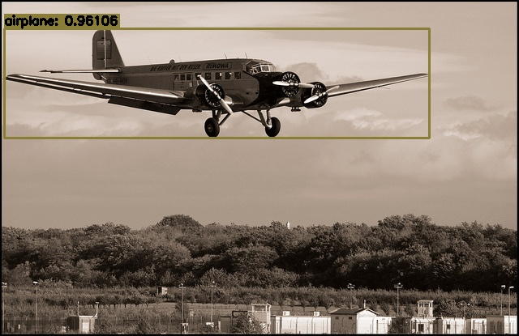

# MindYOLO

<p align="left">
    <a href="https://github.com/mindspore-lab/mindyolo/blob/master/README.md">
        
    </a>
    <a href="https://github.com/mindspore-lab/mindyolo/blob/master/LICENSE">
        
    </a>
    <a href="https://github.com/mindspore-lab/mindyolo/pulls">
        
    </a>
</p>

MindYOLO is [MindSpore Lab](https://github.com/mindspore-lab)'s software system that implements state-of-the-art YOLO series algorithms, [model support list](./configs/README.md). It is written in Python and powered by the [MindSpore](https://mindspore.cn/) deep learning framework.

The master branch works with **MindSpore 1.8.1**.




## What is New 
- 2023/03/30
1. Currently, the models supported by the first release include the basic specifications of YOLOv3/YOLOv5/YOLOv7;
2. Models can be exported to MindIR/AIR format for deployment.
3. ⚠️ The current version is based on the static shape of GRAPH. The dynamic shape of the PYNATIVE will be added later. Please look forward to it.
4. ⚠️ The current version only supports the Ascend platform, and the GPU platform will support it later.

## Benchmark and Model Zoo

<details open>
<summary><b>Supported Algorithms</b></summary>

- [x] [YOLOv7](configs/yolov7)
- [x] [YOLOv5](configs/yolov5)
- [x] [YOLOv3](configs/yolov3)
- [ ] [YOLOv6](configs/yolov6)
- [ ] [YOLOv8](configs/yolov6)
- [ ] [YOLOX](configs/yolox)

</details>

## Installation

To be supplemented.

## Getting Started

See [GETTING STARTED](GETTING_STARTED.md)

## Learn More about MindYOLO

To be supplemented.

## Notes
### How to Contribute

We appreciate all contributions including issues and PRs to make MindYOLO better. 

### License

MindYOLO is released under the [Apache License 2.0](LICENSE.md).

### Acknowledgement

MindYOLO is an open source project that welcome any contribution and feedback. We wish that the toolbox and benchmark could serve the growing research community by providing a flexible as well as standardized toolkit to reimplement existing methods and develop their own new realtime object detection methods.

### Citation

If you find this project useful in your research, please consider cite:

```latex
@misc{MindSpore Object Detection YOLO 2023,
    title={{MindSpore Object Detection YOLO}:MindSpore Object Detection YOLO Toolbox and Benchmark},
    author={MindSpore YOLO Contributors},
    howpublished = {\url{https://github.com/mindspore-lab/mindyolo}},
    year={2023}
}
```

