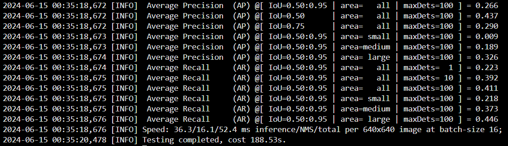
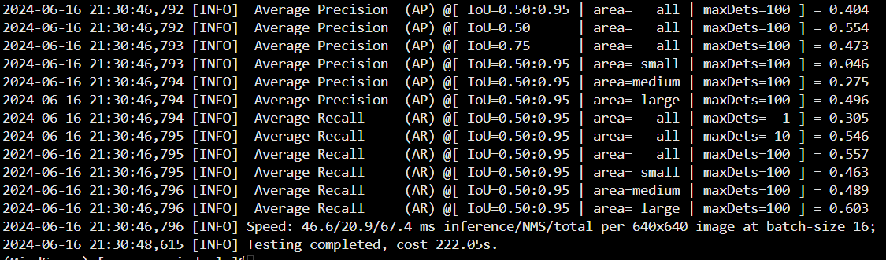
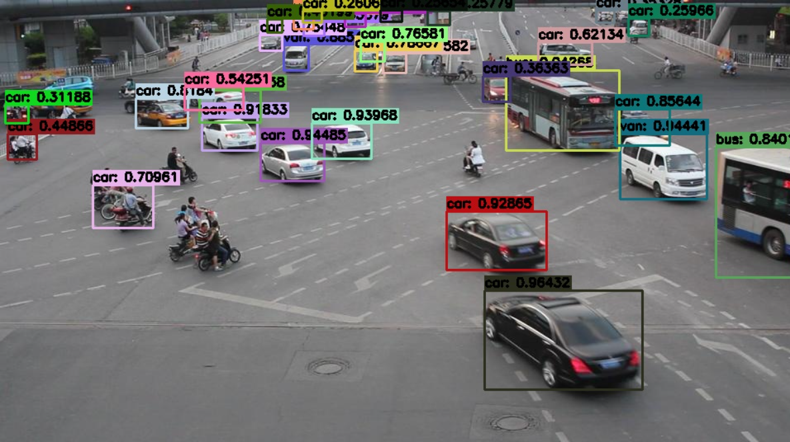

# 基于MindYOLO的车辆检测案例输出

## 数据集介绍

[UA-DETRAC车辆检测数据集](http://detrac-db.rit.albany.edu/)是一个具有挑战性的现实世界多目标检测和多目标跟踪基准。该数据集包含使用佳能 EOS 550D 相机在中国北京和天津的 24 个不同地点拍摄的 10 小时视频。视频以每秒 25 帧 (fps) 的速度录制，分辨率为 960×540 像素。UA-DETRAC 数据集中有超过 14 万帧和 8250 辆手动标注的车辆，总共有 121 万个标记的对象边界框，其中训练集约82085张图片，测试集约56167张图片。该数据集可用于多目标检测和多目标跟踪算法开发。

本次实验选取训练集8639张图片，验证集2231张图片。目标检测分为四类：car，bus，van，others。
## 数据集格式转换
MindYOLO在train过程中支持yolo格式的数据集，需要下载yolo格式的UA-DETRAC。在yolo格式中，标注以.txt文本文件的形式存储，每个图像一个文件。
每行代表一个对象，格式为：class_id，x_center，y_center，width，height，其中所有的值都是归一化到图像尺寸的。
图像和标签通常分别存储在images和labels目录下。还包括train.txt和val.txt用来保存每张图片的路径。

需要注意的是，由于MindYOLO在验证阶段选用图片名称作为image_id，因此图片名称只能为数值类型，而不能为字符串类型，还需要对图片进行改名。

其格式为：
```
UA-DETRAC
├── train.txt
├── val.txt
├── images
│       ├── train
│       │     ├── 0001.jpg
│       │     ├── 0002.jpg
│       │     ├── ...
│       │     └── ...
│       └── val
│             ├── 0001.jpg
│             ├── 0002.jpg
│             ├── ...
│             └── ...
└── labels
        ├── train
        │     ├── 0001.txt
        │     ├── 0002.txt
        │     ├── ...
        │     └── ...
        └── val
              ├── 0001.txt
              ├── 0002.txt
              ├── ...
              └── ...
```
MindYOLO在后续的eval过程中需要用到coco格式中annotations的内容，所以需要在yolo数据集格式的基础上，根据labels来生成annotations里的json文件内容。
可参考[to_annotations.py](./to_annotations.py)，先后生成train和val的json内容。

最后得到的数据集格式为：
```
UA-DETRAC
├── train.txt
├── val.txt
├── annotations
│       ├── instances_train2017.json
│       └── instances_val2017.json
├── images
│       ├── train
│       │     ├── 0001.jpg
│       │     └── ...
│       └── val
│             ├── 0001.jpg
│             └── ...
└── labels
        ├── train
        │     ├── 0001.txt
        │     └── ...
        └── val
              ├── 0001.txt
              └── ...
```


## 模型选择

选择模型时，尝试着先用较小的模型yolov7-tiny来完成实验并测试结果精度，之后再尝试更复杂的模型如yolov7l来进行实验，达到更好的效果。
预训练模型权重参数可以在[MODEL_ZOO.md](../../MODEL_ZOO.md)中下载得到。
## yolov7-tiny实验过程
### 编写yaml配置文件

MindYOLO支持yaml文件继承机制，因此新编写的配置文件只需要继承MindYOLO提供的原生yaml文件现有配置文件，
用yolov7-tiny进行车辆检测的配置文件见[yolov7-tiny_ud.yaml](./yolov7-tiny_ud.yaml)。
其中对实验所使用的UA-DETRAC数据集内容进行设定，strict_load设为False，初始学习率lr_init设置为0.001，其他用原生yaml中的默认配置。
### 训练过程
本次实验在启智云平台上进行，创建云脑任务中的训练任务，传入模型和数据集，操作步骤可以参考[openai_CN.md](../../tutorials/cloud/openi_CN.md)
。这里要注意的是云平台的模型存放路径较以前有变化，若是找不到路径可以利用云平台提供的C2Net库得到预训练模型路径，在train.py中修改weight和ckpt_url参数的值。

也可以选择在终端用命令行进行训练：
* 在多卡NPU/GPU上进行分布式模型训练，以8卡为例:
  ```shell
  mpirun --allow-run-as-root -n 8 python train.py --config ./yolov7-tiny_ud.yaml --is_parallel True
  ```

* 在单卡NPU/GPU/CPU上训练模型：
  ```shell
  python train.py --config ./yolov7-tiny_ud.yaml
  ```

### yolov7-tiny的最终精度：
保存训练得到的权重参数的ckpt文件，用来测试精度和推理。
* 在单卡NPU/GPU/CPU上评估模型的精度：

  ```shell
  python test.py --config ./yolov7-tiny_ud.yaml --weight /path_to_ckpt/WEIGHT.ckpt
  ```
* 在多卡NPU/GPU上进行分布式评估模型的精度：

  ```shell
  mpirun --allow-run-as-root -n 8 python test.py --config ./yolov7-tiny_ud.yaml --weight /path_to_ckpt/WEIGHT.ckpt --is_parallel True
  ```
  通过yolov7-tiny在UA-DETRAC数据集上300轮的训练，完整实现了车辆检测的效果。但由于该网络参数较少，能提取到的抽象特征不够全面和深层，对结果的精度存在一定的限制，
如图看到整体的推理精度AP(IoU=0.50:0.95)只达到0.266。所以后续尝试用更大的网络模型yolo7l来训练，以达到更好的检测效果。



## 优化策略
* 数据增强：采用随机翻转、旋转、缩放、裁剪、颜色变换等，增加模型的泛化能力，增强模型的鲁棒性。
* 模型选择：采用更深层、参数更庞大的网络，提取和表达特征的能力更强。
* 超参数优化：选择合适的初始学习率和学习率调度策略；根据NPU内存调整Batch Size，更大的批量可以提高训练稳定性。


## yolo7l实验过程
### 编写yaml配置文件
同样利用文件继承机制，编写yolov7在UA-DETRAC数据集上的配置文件，详见[yolov7l_ud.yaml](./yolov7l_ud.yaml)
### 训练过程
训练方法与上文中yolov7-tiny相似，但由于这次用的网络参数更加庞大，所以整个训练时间会更长。
### yolov7l的最终精度
改用yolov7l之后，模型的训练精度得到显著提升，达到了AP(IoU=0.50:0.95) = 0.404，更多结果数据如下图所示：

### 可视化推理
 使用内置配置进行推理，运行以下命令：
```shell
# NPU (默认)
python demo/predict.py --config ./yolov7l_ud.yaml --weight=/path_to_ckpt/WEIGHT.ckpt --image_path /path_to_image/IMAGE.jpg

# GPU
python demo/predict.py --config ./yolov7l_ud.yaml --weight=/path_to_ckpt/WEIGHT.ckpt --image_path /path_to_image/IMAGE.jpg --device_target=GPU
```

