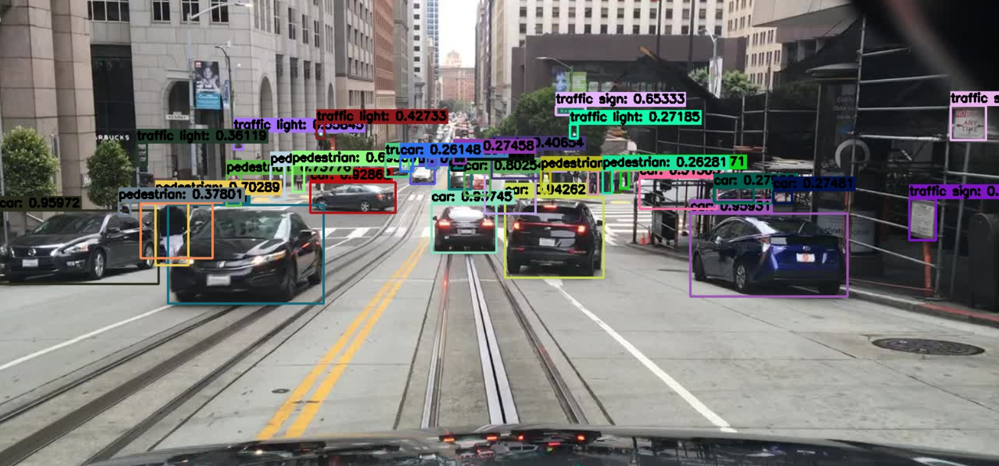
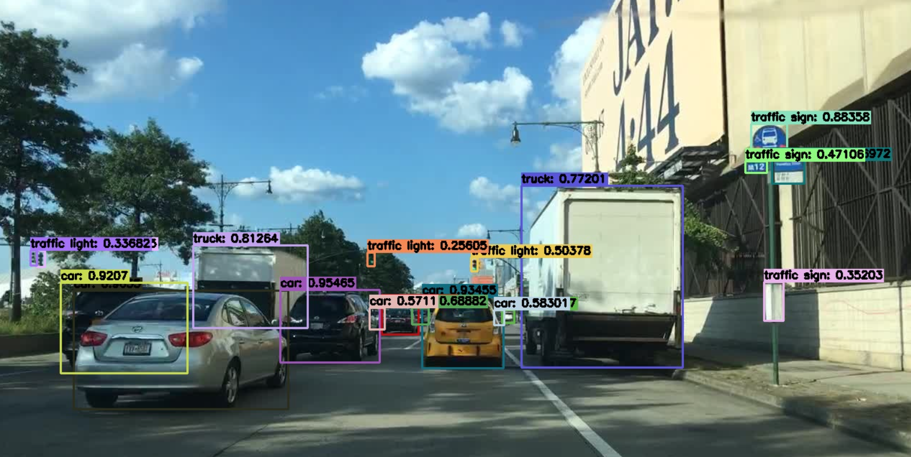
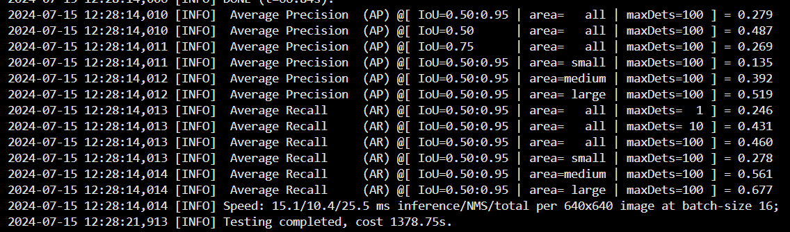
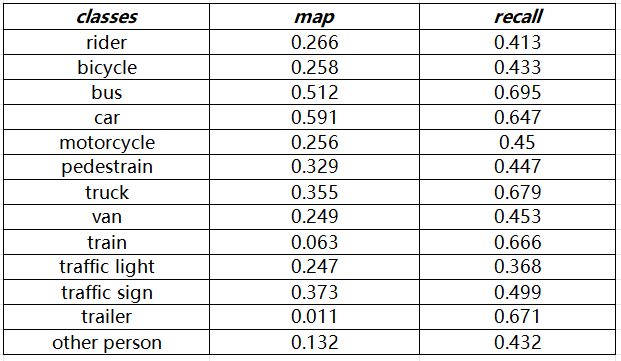
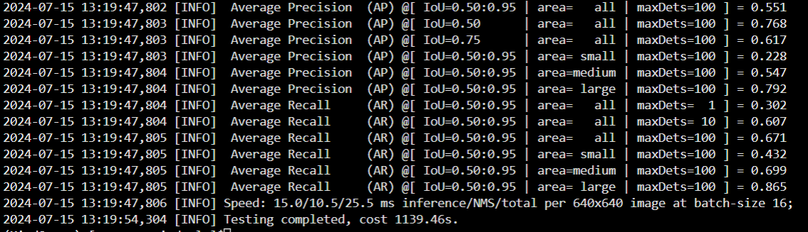

# 基于MindYOLO的车辆检测案例输出

Requirements

| mindspore | ascend driver | firmware | cann toolkit/kernel
| :---: | :---: | :---: | :---:
| 2.2.10 | 23.0.2         |  7.1.0.4.220   | 7.0.0.beta1

## 数据集介绍
本次实验使用了BDD100K和UA-DETRAC两个数据集，需要进行相应的格式转换和数据集整合。

[BDD100K数据集](http://bdd-data.berkeley.edu)是加州大学伯克利分校（UC Berkeley）的Berkeley Artificial Intelligence Research (BAIR) Lab发布的一个大规模、多样化的自动驾驶视频数据集。它有包含道路目标边界框的10万张图片，其中训练集7万，测试集2万，验证集1万。这个数据集旨在促进自动驾驶技术和计算机视觉领域的发展，特别是为了应对在不同环境和条件下进行驾驶的挑战。

[UA-DETRAC车辆检测数据集](http://detrac-db.rit.albany.edu/)是一个具有挑战性的现实世界多目标检测和多目标跟踪基准。该数据集包含使用佳能 EOS 550D 相机在中国北京和天津的 24 个不同地点拍摄的 10 小时视频。视频以每秒 25 帧 (fps) 的速度录制，分辨率为 960×540 像素。UA-DETRAC 数据集中有超过 14 万帧和 8250 辆手动标注的车辆，总共有 121 万个标记的对象边界框，其中训练集约82085张图片，测试集约56167张图片。该数据集可用于多目标检测和多目标跟踪算法开发。


## 数据集格式转换
MindYOLO在train过程中支持yolo格式的数据集。在yolo格式中，标注以.txt文本文件的形式存储，每个图像一个文件。每行代表一个对象，格式为：class_id，x_center，y_center，width，height，其中所有的值都是归一化到图像尺寸的。图像和标签通常分别存储在images和labels目录下。还包括train.txt和val.txt用来保存每张图片的路径，路径生成脚本可以参考[valtxt.py](./valtxt.py)。

下载得到的VOC格式的数据集的标签是以XML文件标注的，需要转换为yolo格式中的txt标注形式，可以参考脚本[voc2yolo.py](./voc2yolo.py)

需要注意的是，由于MindYOLO在验证阶段选用图片名称作为image_id，因此图片名称只能为数值类型，而不能为字符串类型，还需要对图片进行改名，同样作为标注的每个txt文件也需要改名。改文件名脚本可以参考[rename.py](./rename.py)。

MindYOLO在后续的eval过程中需要用到coco格式中annotations的内容，所以需要在yolo数据集格式的基础上，根据labels来生成annotations里的json文件内容。可参考[crejson.py](./crejson.py)，生成验证集的json内容。

最后得到的数据集格式为：
```
bdd_ud
├── train.txt
├── val.txt
├── annotations
│       ├── instances_train2017.json
│       └── instances_val2017.json
├── images
│       ├── train
│       │     ├── 0001.jpg
│       │     ├── 0002.jpg
│       │     └── ...
│       └── val
│             ├── 0001.jpg
│             ├── 0002.jpg
│             └── ...
└── labels
        ├── train
        │     ├── 0001.txt
        │     ├── 0002.txt
        │     └── ...
        └── val
              ├── 0001.txt
              ├── 0002.txt
              └── ...
```
## 数据集整合
整合两个不同的车辆检测数据集时，并不是简单的合并就可以的，需要考虑多个方面以确保合并后的数据集仍然保持高质量和一致性，这对于后续的模型训练和评估至关重要。

首先，由于UA-DETRAC数据集中的测试数据不含标注且没有单独给出验证集，我们只能用从训练数据中划分验证集，bdd100k的验证集包含10000张图片，所以这里划分的时候也从UA-DETRAC的训练集中划分一万左右的图片作为验证集，剩下七万多张图片用作训练集。

本次实验整合的类别是：'rider', 'pedestrian', 'trailer', 'train','bus','car','truck','traffic sign','traffic light','other person','motorcycle','bicycle','van'。其中12个类别属于bdd100k中的标注，然后增加了一个UA-DETRAC数据集中的类别"van"，两个数据集重合的类别是"bus"和"car"。在处理标签的时候，需要在丢弃UA-DETRAC数据集中原本带有的"others"类别，因为可能和bdd100k中的其他类别重合，影响模型的识别结果。

在整合数据集的过程中，进行充分的测试和验证是非常重要的，以确保合并的数据集不会引入新的偏见或错误。需要注意的是多次检查图片数据和标签数据的数量是否对的上，整合时需要统一改名为数字类型，如果数量对不上就会造成标签数据和图片也对不上，所以最好是改名之前就检查到位。

## 实验过程

选择模型时，尝试着先用较小的模型yolov7-tiny在普通的UA-DETRAC数据集上来完成实验并测试结果精度，之后再尝试更复杂的模型如yolov7l在整合后的数据集上来进行实验，识别更多的类别达到更好的效果。
预训练模型权重参数可以在[模型仓库](../../benchmark_results.md)中下载得到。
## yolov7-tiny实验过程
### 编写yaml配置文件

MindYOLO支持yaml文件继承机制，因此新编写的配置文件只需要继承MindYOLO提供的原生yaml文件现有配置文件，
用yolov7-tiny进行车辆检测的配置文件见[yolov7-tiny_ud.yaml](./yolov7-tiny_ud.yaml)。
其中对实验所使用的UA-DETRAC数据集内容进行设定，strict_load设为False，初始学习率lr_init设置为0.001，其他用原生yaml中的默认配置。
### 训练过程
本次实验在启智云平台上进行，创建云脑任务中的训练任务，传入模型和数据集，操作步骤可以参考[openai_CN.md](../../tutorials/cloud/openi_CN.md)。
这里要注意的是云平台的模型存放路径较以前有变化，若是找不到路径可以利用云平台提供的C2Net库得到预训练模型路径，在train.py中修改weight和ckpt_url参数的值。

也可以选择在终端用命令行进行训练：
* 在多卡NPU上进行分布式模型训练，以8卡为例:
  ```shell
  msrun --worker_num=8 --local_worker_num=8 --bind_core=True --log_dir=./yolov7-tiny_log python train.py --config ./yolov7-tiny_ud.yaml --is_parallel True
  ```

* 在单卡NPU/CPU上训练模型：
  ```shell
  python train.py --config ./yolov7-tiny_ud.yaml
  ```

由于yolov7-tiny模型比较小，直接用单卡训练就可以满足需求，所以这里选择用单卡进行训练。
### yolov7-tiny的最终精度：
保存训练得到的权重参数的ckpt文件，用来测试精度和推理。
* 在单卡NPU/CPU上评估模型的精度：

  ```shell
  python test.py --config ./yolov7-tiny_ud.yaml --weight /path_to_ckpt/WEIGHT.ckpt
  ```
* 在多卡NPU上进行分布式评估模型的精度：

  ```shell
  msrun --worker_num=8 --local_worker_num=8 --bind_core=True --log_dir=./yolov7-tiny_log python test.py --config ./yolov7-tiny_ud.yaml --weight /path_to_ckpt/WEIGHT.ckpt --is_parallel True
  ```

  
通过yolov7-tiny在UA-DETRAC数据集上300轮的训练，完整实现了车辆检测的效果。但由于该网络参数较少，能提取到的抽象特征不够全面和深层，对结果的精度存在一定的限制。
这里使用单卡计算精度，其结果的整体的推理精度AP(IoU=0.50:0.95)只达到0.266。所以后续尝试用更大的网络模型yolo7l在整合后的数据集上来训练，以达到更好的检测效果。

## 优化策略
* 数据集优化：训练时使用更完善的整合后的数据集，扩大识别的类别数量，提高检测效果。
* 模型选择：采用更深层、参数更庞大的网络，提取和表达特征的能力更强。


## yolo7l在整合数据集上的实验过程
### 编写yaml配置文件
同样利用文件继承机制，编写yolov7在UA-DETRAC数据集上的配置文件，对比上一个实验主要修改了模型识别的类别和数据集地址的部分，详见[bdd_ud.yaml](./bdd_ud.yaml)
### 训练过程
训练方法与上文中yolov7-tiny相似，但由于这次用的网络参数更加庞大，再加上用的是整合过的数据集，数据量也更大。所以训练过程会更复杂，整个训练时间会更长，可以尝试使用多卡训练，本次对用yolo7l模型在整合数据集上的实验使用4卡进行分布式模型训练。

### 可视化推理
 使用内置配置进行推理，运行以下命令：
```shell
# NPU (默认)
python demo/predict.py --config ./yolov7l_ud.yaml --weight=/path_to_ckpt/WEIGHT.ckpt --image_path /path_to_image/IMAGE.jpg

```




通过可视化推理的效果图，可以清晰的发现，这个模型已经达到良好检测效果。在复杂的道路环境中依然能够精准地识别出各种类型的车辆，可以识别图像中从car、bus到pedestrain、traffic sign等等的多种类别，几乎不遗漏任何细节。即使是到夜晚光线较暗或者是恶劣天气，也能维持稳定的检测效果。

### 关于模型的最终精度
#### 分析
首先，由于在整合数据时，在最后的验证集中不可避免的出现标签缺少的现象，因为两个数据集不重合的类别标签只存在其中一个数据集中，只有重合类别的标签在两个数据集中都存在。由此一来，理论上就会导致检测精度的时候对于模型成功识别出来的目标可能并没有真实标签与之对应，带来精度损失。验证集中缺乏某些类别的标签，这意味着模型在这些类别上的表现无法得到准确评估。模型可能在训练集中的所有类别上表现良好，但在验证集上，由于某些类别的缺失，整体精度会显得偏低，但对召回率的影响不大。

其次，对于重合类别，模型可以从多个数据集中获取更多的训练样本，这增加了模型学习这些类别特征的机会，模型更容易学习到这些类别的共同特征，从而提高了精度。相比之下，不重合类别的数据可能只存在于一个或少数几个数据集中，数据量较少，模型学习的特征可能不够全面，难以捕捉到足够的特征模式，特别是在这些类别内部的变异性较大时，导致精度较低。

所以这里检测精度时我们会进行多次验证，先计算整体精度和召回率，再对模型识别的13个类别分开进行精度和召回率的测试，尝试获取更多重合类别和不重合类别的数据，验证结果。

#### 精度结果
首先计算所有类别的整体的精度结果，得到的map为0.279，但召回率达到了还不错的水平，与我们之前分析的结果类似。结果图如下：

接下来修改.json文件中的标签，限制类别，对各个类别分开进行精度的计算，对猜想进行进一步的检验。整理的表格如下图：

从表格中可以清晰地看见，对于两个数据集重合的类别的精度值都高达0.5左右的，然而不重合类别的精度却损失明显。尽管如此，它们的召回率仍然都在比较高的水平。结合上面的理论分析，可以确定所有类别的整体精度结果并不是模型的真实检测水平，下面我们利用所有重合类别来计算模型的有效精度。

综上所述，整合数据集后，模型可以识别更多个类别并通过可视化推理看到已经达到不错的预测效果，但由于验证集的标签问题，计算模型真正有效的精度需要限定为重合类别，经过检验得到其结果达到了AP(IoU=0.50:0.95) = 0.551，更多结果数据如下图所示：


<br><br>
