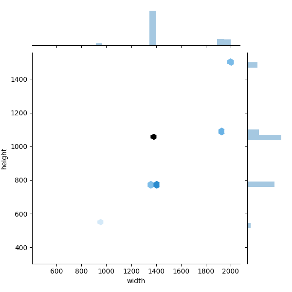
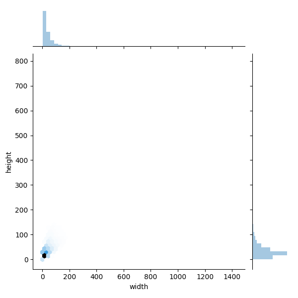
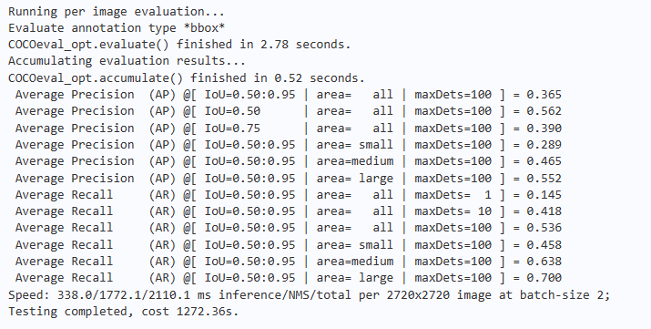
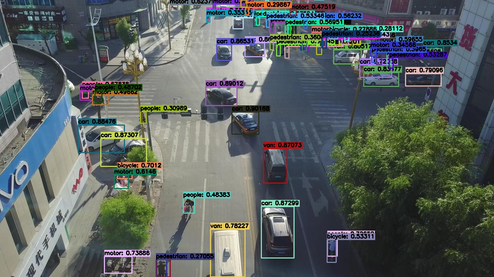
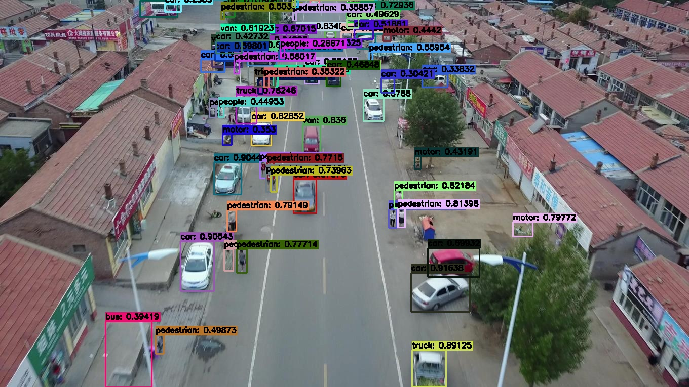

# 基于MindYOLO的无人机航拍图像检测案例输出

Requirements

| mindspore | ascend driver | firmware     | cann toolkit/kernel |
| :-------: | :-----------: | :----------: |:-------------------:|
|   2.5.0   |    24.1.0     | 7.5.0.3.220  |     8.0.0.beta1     |

## 数据集介绍

[VisDrone-Dataset](https://github.com/VisDrone/VisDrone-Dataset)是2019年由天津大学发布的一项无人机识别挑战中的数据集，其共有5个子任务，包括图像目标检测、视频目标检测、单目标跟踪、多目标跟踪、人群计数等。

其中的图像目标检测任务数据集，包含10个目标类别，10209张图像，共54200个目标，图像大小为2000\*1500\*3，由无人机采集得到，采用horizontal bounding boxes的标注格式。

每个样本中，每幅图像对应一个txt文件，txt的每行代表1个目标，由bbox_left、bbox_top、bbox_width、bbox_height、score、object_category、truncation、occlusion8个值表示，其中bbox_left、bbox_top、bbox_width、bbox_height分别表示样本框的左上角横坐标、左上角纵坐标、框长度、框宽度.

原始数据集格式为：

```
ROOT_DIR
├── VisDrone2019-DET-train
│       ├── images
│       │     ├── 0000000_00000_d_0000001.jpg
│       │     ├── 0000000_00000_d_0000002.jpg
│       │     ├── ...
│       │     └── ...
│       └── annotations
│             ├── 0000000_00000_d_0000001.txt
│             ├── 0000000_00000_d_0000002.txt
│             ├── ...
│             └── ...
└── VisDrone2019-DET-val
        ├── images
        │     ├── 0000001_00000_d_0000001.jpg
        │     ├── 0000001_00000_d_0000002.jpg
        │     ├── ...
        │     └── ...
        └── annotations
              ├── 0000001_00000_d_0000001.txt
              ├── 0000001_00000_d_0000002.txt
              ├── ...
              └── ...

```

## 数据集格式转换

mindyolo中的train过程使用的数据是yolo格式，而eval过程使用coco数据集中的json文件，因此需要对数据集进行转换。

yolo格式标注中，每幅图像对应一个txt文件，txt的每行代表1个目标，由id、center_x、center_y、w、h等5个值表示，其中center_x、center_y、w、h分别表示样本框的归一化中心点横坐标、归一化中心点纵坐标、框长度、框宽度；并通过train.txt、val.txt记录图片路径。

yolo格式的bbox格式与visdrone数据集的对象框格式不同，因此需要通过以下步骤进行格式转换：

- 创建新的文件夹结构，读取原有文件列表；
- 将图片复制到新的文件夹下；
- 读取原有对象框信息，将左上角坐标信息转换成中心点坐标信息；
- 对于train，保存txt文件，对于val，将对象框信息与图像信息、类别信息一起保存为json文件。

详细实现可参考[convert_visdrone2yolo.py](./convert_visdrone2yolo.py)，运行方式如下：

```
python convert_visdrone2yolo.py \
        --img_dir /path_to_visdrone/VisDrone2019-DET-train/images \
        --gt_dir /path_to_visdrone/VisDrone2019-DET-train/annotations \
        --json_path /path_to_visdrone/visdrone/annotations/instances_train2017.json \
        --img_dir_dst /path_to_visdrone/visdrone/train/images \
        --gt_dir_dst /path_to_visdrone/visdrone/train/labels \
        --txt_path /path_to_visdrone/visdrone/train.txt
      
python convert_visdrone2yolo.py \
        --img_dir /path_to_visdrone/VisDrone2019-DET-val/images \
        --gt_dir /path_to_visdrone/VisDrone2019-DET-val/annotations \
        --json_path /path_to_visdrone/visdrone/annotations/instances_val2017.json \
        --img_dir_dst /path_to_visdrone/visdrone/val/images \
        --gt_dir_dst /path_to_visdrone/visdrone/val/labels \
        --txt_path /path_to_visdrone/visdrone/val.txt
```

运行以上命令将在不改变原数据集的前提下，在同级目录生成yolo格式的visdrone数据集。

经过转换后的visdrone数据集包括以下内容：

```
visdrone
├── train.txt
├── val.txt
├── train
│       ├── images
│       │     ├── 000001.jpg
│       │     ├── 000002.jpg
│       │     ├── ...
│       │     └── ...
│       └── labels
│             ├── 000001.txt
│             ├── 000002.txt
│             ├── ...
│             └── ...
├── annotations
│       ├── instances_train2017.json
│       └── instances_val2017.json
└── val
        ├── images
        │     ├── 000001.jpg
        │     ├── 000002.jpg
        │     ├── ...
        │     └── ...
        └── labels
              ├── 000001.txt
              ├── 000001.txt
              ├── ...
              └── ...

```

## 模型选择

在选择具体的模型尺寸时，提取val部分数据作为miniVisDrone数据集，快速训练测试网络性能。拟使用较新的模型yolov7、yolov8进行训练。

首先使用轻量级模型yolov7t、yolov8m在mini visdrone上训练50epoch，精度分别为0.215、0.203。在轻量级模型上，yolov8效果较yolov7差，因此在后续训练中优先训练yolov7t，在后续训练中根据模型训练效果换用yolov7l、yolov8l。

## 编写yaml配置文件

MindYOLO支持yaml文件继承机制，因此新编写的配置文件只需要继承MindYOLO提供的原生yaml文件现有配置文件，最终的数据集配置文件见[visdrone.yaml](./visdrone.yaml)、yolov8l的配置文件见[yolov8-l-visdrone.yaml](./yolov8-l-visdrone.yaml)

## 优化策略

- 更换大参数模型：yolov7tiny训练精度上限较低，改为yolov7large
- 改用更大的image shape：使用[sta_anno.py](./sta_anno.py)、[sta_img.py](./sta_img.py)可以得到对样本的图像与对象框size的分布情况。根据统计结果可以看到，样本的shape分布情况（均在1400 * 800以上）与目标的shape分布情况（均在200 * 200以下），因此该任务属于小目标检测，原始配置中的640 * 640样本尺寸过小，需要调大输入图像的尺寸。最终设置finetune img_size为1760，验证img_size为2720。





样本shape分布图



目标shape分布图

- 改用更小的anchor：鉴于目标的shape均在200\*200以下，因此将yolov7中的anchor从[12,16，19,36，40,28] - [36,75，76,55，72,146] - [142,119，192,243，459,481] ，修改为-[12,16，19,36，40,28] - [36,75，76,55，50,50] - [72,146 142,119，192,243]，减少大anchor的尺寸。
- 使用切图策略：由于该任务为小目标检测，因此尝试将训练集切割为小图，在验证时使用大尺寸原图进行验证（无提升）
- 调整学习率：调大、调小学习率（无提升）
- 使用数据增强：对yolov7l的训练过程，增加copy_paste=0.3，提升0.007；增加mixup=0.3,flipud=0.3，（降低0.03）
- 换用yolov8：yolov7的最高精度在0.355，换用yolov8后，精度可以达到0.365

## 微调：
加载由MindYOLO所提供在coco数据集上训练的[模型权重](https://download.mindspore.cn/toolkits/mindyolo/yolov8/yolov8-l_500e_mAP528-6e96d6bb.ckpt)
进行finetune，设置参数strict_load为False将自动丢弃检测头中由数据集类别数不同导致的shape不一致的参数。
运行命令如下：
```
msrun --worker_num=8 --local_worker_num=8 --bind_core=True --log_dir=./yolov8_visdrone python train.py --config ./configs/yolov8/yolov8-l-visdrone.yaml --is_parallel True --weight /path_to_ckpt/WEIGHT.ckpt --strict_load False
```

## 最终精度：
模型训练至120epoch左右可达如下精度



## 推理结果：

使用predict.py测试训练模型参数的结果并进行可视化推理，运行方式如下：

```
python examples/finetune_visdrone/predict.py --config ./configs/yolov8/yolov8-l-visdrone.yaml --weight=/path_to_ckpt/WEIGHT.ckpt --image_path /path_to_image/IMAGE.jpg
```

推理效果如下：






